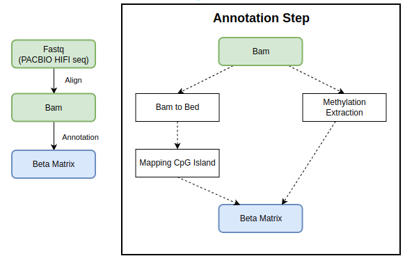

# DNAmPipeline

_DNAmPipeline_ is a tool for estimating methylation level which is the ratioof intensities between methylated and unmethylated alleles. In this project, we use genome assembly GRCh38 to align and other analysis. 



Firstly, we use bismark tool to align list of sequencing pacbio FASTQ data to BAM data with minimap2 option. After that, we extract methylation information of each positions from aligned BAM data in previous step and convert BAM to BED format to annotate CpG island of positions by _Annotatr_ libary developed in R. Finally, we combine annotation CpG data and methylation information
# Input data
Input for _DNAmPipeline_ is a file contains list of fastq file paths. For example:

```
$cat testdata.txt
/media/data/test_data_1.fastq
/media/data/test_data.fastq
```

# Execution

```
python script/pipeline.py --fastq /media/data/hg38.fa --output-dir output --bismark bismark --file-name data/test_data.txt
```
* fastq: path of hg38 reference file (fa, fastq)
* output-dir: path of output
* bismark: path of bismark tool
* file-name: path of file containg list of fastq input path

